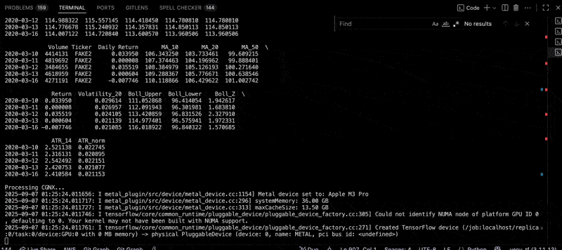
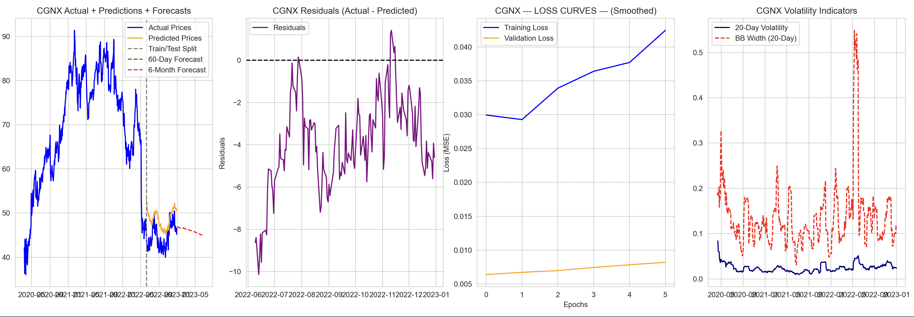

# DeepStock 📊 

**DeepStock** is a deep learning framework for **stock price prediction and forecasting** using LSTMs and feature engineering.  
It supports training, evaluation, and visualization of model performance with **residuals, loss curves, and volatility indicators**.


---

## Features

- Preprocessing with **MinMaxScaler** and rolling features (MA10, MA20, MA50, returns).  

- Sequence generation for supervised learning on time series.  
- LSTM-based forecasting with:
  - Model checkpointing  
  - Early stopping & learning rate scheduling  
- Evaluation metrics:
  - MAE, RMSE, R², MAPE  
  - Directional Accuracy (%)  
  - Bias correction  
- Visualizations:
  - Actual vs. Predicted prices with **forecasts**  
  - Residuals (Actual − Predicted)  
  - Smoothed training/validation loss curves  
  - Volatility indicators (rolling std & Bollinger Band width)  

---

## 📂  Project Structure

```
deepstock/
│
├── data/                  # input stock data (CSV or yfinance)
│
├── checkpoints/           # saved models (.keras)
│
├── results/               # predictions, plots, forecasts
│   ├── predictions.csv
│   ├── future_predictions_60d.csv
│   ├── future_predictions_*_6m.csv
│   └── plots/
│
├── images/                # example plots & animations
│   ├── example1.png
│   └── example2.gif
│
├── prediction.py          # main training + forecasting loop
├── requirements.txt       # dependencies
└── README.md              # project docs
```


---

## Installation

Clone the repo:
```bash
git clone https://github.com/blkpvnthr/deepstock.git
cd deepstock
```
Create a virtual environment:
macOS/Linux
``` bash
python -m venv .venv
source .venv/bin/activate
```
Windows
``` bash
.venv\Scripts\activate
```

Install dependencies:
``` bash
pip install -r requirements.txt
```

---

## Usage

1. Prepare your data

Store your stock data as CSV or fetch it directly with yfinance.
Each DataFrame should include:

- Close
- Daily Return
- MA_10
- MA_20
- MA_50

1. Run training + forecasting
``` bash
   python prediction.py
```

This will:
- Train or load an existing model per ticker.
- Save checkpoints to checkpoints/.
- Generate predictions and forecasts (60-day & 6-month).
- Save plots into results/plots/.

---

## Example Output
> Actual + Predictions + Forecasts
> Residuals & Loss Curves
> Volatility Indicators

### 📊 Example Metrics
``` bash
CGNX Evaluation Metrics:
MAE   : 0.0621
RMSE  : 0.0717
R²    : -1.1457
MAPE  : 48.67%
Directional Accuracy: 46.81%
Bias Correction: +1.235
```
### Actual + Predictions + Forecasts


---

## 🛠 Requirements

> Python 3.10+
> pandas
> numpy
> scikit-learn
> matplotlib
> tensorflow / keras

Install them with:
``` bash
pip install -r requirements.txt
```

---

## 🔮 Roadmap

 Add hyperparameter tuning

 Integrate additional technical indicators

 Support transformer-based time-series models

### Deploy forecasts as a simple API
---
## 📜 License

MIT License.
Feel free to fork and adapt for your own trading experiments 🚀

---

## ✨ Acknowledgements

Inspired by real-world quantitative finance research and experimentation with deep learning on market data.
